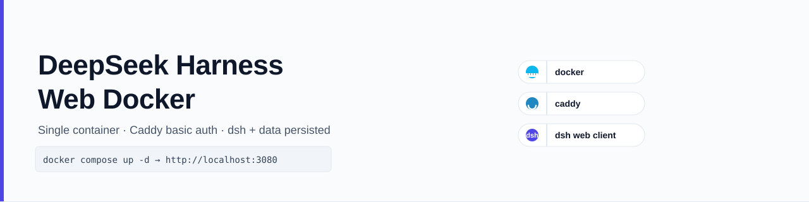

# DeepSeek Harness Web Docker



> [English](README.md) | [中文](README.zh.md)

Containerized deployment of the [DeepSeek Harness](https://github.com/deepseek-ai/deepseek-harness) (dsh) web client: a single container bundles dsh + Caddy (pure reverse proxy, no auth) with configuration and project/session data persisted, and CI automatically pushes GHCR images.

## Features

- Self-contained single container: dsh (loopback only, inside the container) + Caddy pure reverse proxy (Host/Origin rewritten to loopback for the dsh anti-DNS-rebinding fence)
- **Authentication since dsh 0.1.2-rc.1**: moved into dsh itself. On first start, dsh prints a one-time `?token=…` URL; the browser exchanges it for a persistent cookie (survives restarts). Caddy basic auth was removed in 0.1.2-rc.1+ (would have intercepted the browser's first redirect and hidden the token URL)
- Configuration and project/session data persisted: bind mount `./data` → `/home/node` (the whole HOME: settings.yaml, API Key, profiles, sessions, storages, plus agent-installed tools under `~/.x-cmd.root`)
- Runs as non-root (uid 1000); dsh is not exposed directly
- Built-in health check: `docker compose ps` shows the real service health (`starting`/`healthy`/`unhealthy`), exchanging the one-time token for a cookie and probing dsh
- Pinnable image version: build argument `DSH_VERSION`
- CI automatically builds and pushes `ghcr.io/xidong-ai/deepseek-harness-web-docker` (latest + date-time-hash tags)
- A scheduled CI job checks the dsh upstream daily: on a new version it bumps `DSH_VERSION`, builds and smoke-tests the image, pushes to master on success, or opens an Issue on failure (a failed version is not retried automatically while its Issue is open; manual dispatch bypasses the gate)
- The GHCR release can be triggered manually (Actions tab → "Run workflow") or is hooked automatically after an upstream auto-upgrade (`workflow_dispatch`)

## Quick Start

### Option 1: Use the GHCR image

```bash
git clone https://github.com/Xidong-AI/deepseek-harness-web-docker
cd deepseek-harness-web-docker
cp .env.example .env    # edit DEEPSEEK_API_KEY (DSH_AUTH_USER/PASSWORD are now optional, only used on rollback to ≤0.1.1 series)
docker compose up -d    # pull the latest image and start
```

### Option 2: Build locally

```bash
docker compose up -d --build
# or pin a dsh version:
docker build --build-arg DSH_VERSION=${DSH_VERSION:-latest} -t dsh-web:latest .
```

After startup, **read the one-time launch URL** with one of:

```bash
docker compose logs dsh-web | grep 'dsh web:'         # dsh prints it on startup
# or
docker exec dsh-web cat /home/node/.dsh/web-launch-url.txt
```

Then open the printed URL (e.g. `http://<host>:3080/?token=…`) in a browser. The browser is redirected (HTTP 303) to `/` with a persistent cookie set; subsequent visits work without the token. The cookie lives in `./data/.dsh/.credentials.yaml` and survives container restarts (re-roll the token URL each time you recreate the data volume from scratch). The port is `DSH_WEB_PORT` (default 3080).

> **Up to dsh 0.1.1 series** (rollback): open `http://<host>:3080` and use Caddy basic auth (the `DSH_AUTH_USER` / `DSH_AUTH_PASSWORD` in `.env`).

## Environment Variables (.env)

| Variable | Required | Default | Description |
| --- | --- | --- | --- |
| `DSH_AUTH_USER` | No (since 0.1.2-rc.1) | `admin` | Was: Basic Auth username. Now kept only for rollback to ≤0.1.1 series; ignored on 0.1.2-rc.1+ |
| `DSH_AUTH_PASSWORD` | No (since 0.1.2-rc.1) | None | Was: Basic Auth plaintext password (bcrypt hash auto-generated). Now kept only for rollback to ≤0.1.1 series |
| `DEEPSEEK_API_KEY` | Yes | None | DeepSeek API Key (referenced by the provider via apiKeyEnv) |
| `DSH_WEB_PORT` | No | `3080` | Host port exposed to the outside (change it when it conflicts with an existing service) |
| `DSH_TRUSTED_HOSTS` | No | Empty | Comma-separated extra trusted hosts, injected into the profile's `cordis.patch.yml` (only when the file is absent or still the empty template; user-maintained files are skipped — edit the file directly); by default Caddy rewrites Host/Origin to loopback, which covers normal access |
| `DSH_VERSION` | No (build-time) | Upstream latest | dsh version; rebuild with `--build` after changing it |

> `.env` contains passwords and the API Key — never commit it to the repository.

## Data Persistence

All configuration and data is stored in `./data/` under the project directory (git-ignored):

- `settings.yaml`: dsh configuration (auto-generated from the default template on first startup)
- `.credentials.yaml`: credentials (e.g. API Keys configured via the web UI)
- `profiles/web/`: web profile (auto-initialized by dsh on first startup)
- `sessions/`, `storages/`: session and project data

Deleting the container does not affect the data; configuration is preserved after upgrades.

## Upgrading

```bash
docker compose pull && docker compose up -d   # when using the GHCR image
# or rebuild locally:
docker compose build && docker compose up -d
```

## In-Container Tools & Environment

dsh agents run commands inside the container through the bash tool; the available toolset = what's preinstalled in the image + **tools the agent installs itself (x-cmd)**.

### Preinstalled in the image

- Runtime: node 22, npm, pnpm (corepack, required by `dsh plugin`), python3, Caddy, dsh
- Build toolchain: make/gcc/g++/pkg-config (node-gyp fallback for native modules, e.g. a dsh plugin's node-pty), Rust (rustup stable minimal + rustfmt + clippy)
- Agent tools: git, openssh-client, curl/wget (network), jq/yq (JSON/YAML), ripgrep (search), rsync (sync), procps (processes), zip/unzip/tar, file, dig, sqlite3, python3-pip, vim-tiny, ca-certificates

### Agent self-installation (x-cmd, no root required)

The image ships [x-cmd](https://x-cmd.com) (auto-installed to the data volume on first startup; idempotent; Alibaba Cloud OSS source). Inside a dsh session you can run:

```bash
x env use git python jq       # install/enable tools (no root)
x env ls                      # list enabled tools
x env which jq                # show tool path
x jq . data.json              # call with x prefix (always available)
jq . data.json                # bare command: enabled packages are symlinked to /usr/local/bin, directly usable
```

- Install location: `~/.x-cmd.root` (inside the data volume `./data`), **preserved across container restart/rebuild**
- The `x` command and enabled tools are automatically symlinked to `/usr/local/bin` (the agent's bash PATH is fixed; the symlink is the only entry point)
- Newly installed tools are invoked with the `x <pkg>` prefix in the current session; bare commands become available after the container restarts
- Tools come from the x-cmd package source (Alibaba Cloud OSS, reachable from mainland China) and support version management (`x env use node=v20`)

**Sandbox caveat**: x-cmd writes to `~/.x-cmd.root` (inside the data volume) to run. The file sandbox (workspace-write) only permits writes inside the session workspace plus `/tmp`, so this directory is not writable: under a bwrap sandbox `x` refuses to start with `folder defined ___X_CMD_ROOT specified is not writable`; under the Landlock sandbox (this image ships no bwrap) `x` starts and read-only use works — built-in modules (`x version`, `x passwd`) and already-enabled or cached packages (`x <pkg>`, symlinked bare commands) — but installing/enabling new packages fails: `x env use` errors with `permission denied`, `x env ls` silently returns empty. To install new tools the agent must request full permissions (approval), or pick `/home/node` as the session workspace.

For the in-container agent environment guide, see `AGENTS.md` in the data volume (auto-loaded by dsh sessions).


The image already ships a lightweight build toolchain (make/gcc/g++) and Rust, so agents can run `pnpm install`/`cargo build` to compile native modules and projects directly. Other system packages that require root can be added by modifying the `apt-get install` line in the `Dockerfile` and rebuilding, or by adding a layer on top of this image:

```dockerfile
FROM ghcr.io/xidong-ai/deepseek-harness-web-docker:latest
RUN apt-get update && apt-get install -y --no-install-recommends <pkg> \
 && rm -rf /var/lib/apt/lists/*
```

## Changing the Password / Resetting Auth

**dsh 0.1.2-rc.1+ (current)**: dsh's persistent cookie is the auth. To reset (e.g. after a suspected leak), delete the data volume's credentials file and recreate the data volume — `docker compose down -v && docker compose up -d`. The next browser visit must use the new one-time token URL (`docker exec dsh-web cat /home/node/.dsh/web-launch-url.txt`).

**Up to dsh 0.1.1 series (rollback)**: edit `DSH_AUTH_PASSWORD` in `.env`, then run `docker compose up -d` (the entrypoint regenerates the hash automatically).

## Acknowledgements

Thanks to the [Linux.do](https://linux.do) community for support.