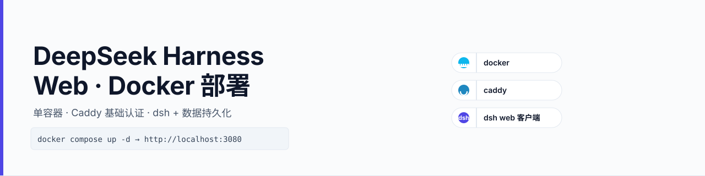

# DeepSeek Harness Web Docker



> [English](README.md) | [中文](README.zh.md)

容器化部署 [DeepSeek Harness](https://github.com/deepseek-ai/deepseek-harness)（dsh）Web 客户端：单容器内含 dsh + Caddy 纯反代，配置与项目/会话数据持久化，CI 自动推送 GHCR 镜像。

## 特性

- 单容器自包含：dsh（仅容器内 loopback）+ Caddy 纯反代（无鉴权，Host/Origin 改写为 loopback 配合 dsh 防 DNS rebinding 的 fence）
- **dsh 0.1.2-rc.1+ 鉴权**：迁回 dsh 自身。dsh 启动时打印一次性 `?token=…` URL，浏览器首次访问该 URL 后 303 跳转并 Set-Cookie，cookie 持久化在数据卷（容器重启后仍有效）。Caddy basic auth 自 0.1.2-rc.1 起移除（旧版会拦截首次重定向、把 dsh 的 token URL 藏住，浏览器根本拿不到）
- 配置与项目/会话数据持久化：bind mount `./data` → `/home/node`（整个 HOME：settings.yaml、API Key、profiles、sessions、storages，及 agent 自装工具 `~/.x-cmd.root`）
- 非 root 运行（uid 1000），dsh 不直接对外暴露
- 内置健康检查：`docker compose ps` 直接可见服务真实健康状态（抓 dsh 一次性 token 换 cookie 后探测 dsh 响应，`starting`/`healthy`/`unhealthy`）
- 镜像版本可 pin：构建参数 `DSH_VERSION`
- CI 自动构建并推送 `ghcr.io/xidong-ai/deepseek-harness-web-docker`（latest + 日期时间 - 哈希 tag）
- 定时任务每日检查 dsh 上游：有新版本自动提升 `DSH_VERSION`、构建并冒烟测试，通过则推送 master 并钩住触发 GHCR 发布，失败则创建 Issue（存在同版本未关闭 Issue 时不再自动重试，可手动触发强制重试）
- GHCR 发布可手动触发（Actions 页「Run workflow」）或由上游升级自动钩住触发（`workflow_dispatch`）

## 快速开始

### 方式一：使用 GHCR 镜像

```bash
git clone https://github.com/Xidong-AI/deepseek-harness-web-docker
cd deepseek-harness-web-docker
cp .env.example .env    # 编辑 DEEPSEEK_API_KEY（DSH_AUTH_USER/PASSWORD 自 0.1.2-rc.1 起可选，仅回退到 ≤0.1.1 系列时需要）
docker compose up -d    # 拉取 latest 镜像并启动
```

> ⚠️ **升级警告 — 升级到含 dsh 0.1.2-rc.1+ 鉴权迁移的版本时,必须先 `git pull` 同步 `docker-compose.yml` / `Caddyfile` / `entrypoint.sh` 内的 token 抓取后台任务,仅 `docker compose pull` 拉新 image 配旧 compose 文件会导致 healthcheck 永远 unhealthy 且 web 服务裸奔(无鉴权)。** 具体见 PR #7 的 commit message 与 DESIGN.md §10 的版本演进记录。

### 方式二：本地构建

```bash
docker compose up -d --build
# 或指定 dsh 版本：
docker build --build-arg DSH_VERSION=0.1.2-rc.1 -t dsh-web:latest .
```

启动后**先取一次性启动 URL**，任选一种方式：

```bash
docker compose logs dsh-web | grep 'dsh web:'         # dsh 启动时打印
# 或
docker exec dsh-web cat /home/node/.dsh/web-launch-url.txt
```

把打印的 URL（如 `http://<主机>:3080/?token=…`）粘到浏览器访问。浏览器被 303 重定向到 `/` 并写入持久 cookie；之后访问不再需要 token。cookie 存于 `./data/.dsh/.credentials.yaml`，容器重启仍有效（重新创建数据卷才需重抓 token URL）。外部端口由 `DSH_WEB_PORT` 控制（默认 3080）。

> **dsh ≤0.1.1 系列（回退情况）**：浏览器直接访问 `http://<主机>:3080`，输入 Caddy basic auth 用户名密码（`.env` 里的 `DSH_AUTH_USER` / `DSH_AUTH_PASSWORD`）。

## 环境变量（.env）

| 变量 | 必填 | 默认 | 说明 |
| --- | --- | --- | --- |
| `DSH_AUTH_USER` | 否（自 0.1.2-rc.1） | `admin` | 旧版 basic auth 用户名；0.1.2-rc.1+ 已忽略，仅作回退兼容位 |
| `DSH_AUTH_PASSWORD` | 否（自 0.1.2-rc.1） | 无 | 旧版 basic auth 明文密码（容器启动时自动生成 bcrypt 哈希）；0.1.2-rc.1+ 已忽略，仅作回退兼容位 |
| `DEEPSEEK_API_KEY` | 是 | 无 | DeepSeek API Key（provider 经 apiKeyEnv 引用） |
| `DSH_WEB_PORT` | 否 | `3080` | 宿主机对外端口（与已有服务冲突时修改） |
| `DSH_TRUSTED_HOSTS` | 否 | 空 | 逗号分隔的额外受信 Host，注入 profile 的 `cordis.patch.yml`（仅当该文件不存在或仍为空模板时自动注入；已维护则跳过，请直接编辑该文件）；默认靠 Caddy 改写 Host/Origin 为 loopback 已覆盖常规访问 |
| `DSH_VERSION` | 否（构建期） | 上游最新 | dsh 版本，修改后需 `--build` 重建 |

> `.env` 含密码与 API Key，禁止提交入库。

## 数据持久化

所有配置与数据保存在项目目录 `./data/`（git 已忽略）：

- `settings.yaml`：dsh 配置（首启自动从默认模板生成）
- `.credentials.yaml`：凭据（如经 Web UI 配置的 API Key）
- `profiles/web/`：web profile（首启由 dsh 自动初始化）
- `sessions/`、`storages/`：会话与项目数据

删除容器不影响数据；升级后配置保留。

## 升级

```bash
docker compose pull && docker compose up -d   # 使用 GHCR 镜像时
# 或本地重建：
docker compose build && docker compose up -d
```

## 容器内工具与环境

dsh 的 agent 通过 bash 工具在容器内执行命令，可用工具集 = 镜像预装 + **agent 自行安装（x-cmd）**。

### 镜像预装

- 运行时：node 22、npm、pnpm（corepack，`dsh plugin` 依赖）、python3、Caddy、dsh
- 编译工具链：make/gcc/g++/pkg-config（node-gyp 编译 native 模块兜底，如 dsh 插件的 node-pty）、Rust（rustup stable minimal + rustfmt + clippy）
- agent 工具：git、openssh-client、curl/wget（网络）、jq/yq（JSON/YAML）、ripgrep（搜索）、rsync（同步）、procps（进程）、zip/unzip/tar、file、dig、sqlite3、python3-pip、vim-tiny、ca-certificates

### agent 自行安装（x-cmd，免 root）

镜像内置 [x-cmd](https://x-cmd.com)（首启自动安装到数据卷，幂等；阿里云 OSS 源）。dsh 会话中可直接执行：

```bash
x env use git python jq       # 安装/启用工具（免 root）
x env ls                      # 查看已启用工具
x env which jq                # 查看工具路径
x jq . data.json              # x 前缀调用（任何情况都可用）
jq . data.json                # 裸命令：已启用包已软链至 /usr/local/bin，直接可用
```

- 安装位置：`~/.x-cmd.root`（数据卷 `./data` 内），**容器重启/重建后保留**
- `x` 命令与已启用工具自动软链至 `/usr/local/bin`（agent 的 bash 环境 PATH 固定，软链是唯一接入点）
- 新安装的工具本会话用 `x <pkg>` 前缀调用，容器重启后裸命令可用
- 工具源为 x-cmd 包源（阿里云 OSS，国内可达），支持版本管理（`x env use node=v20`）

**沙箱注意**：x-cmd 运行需写 `~/.x-cmd.root`（数据卷内）。文件沙箱（workspace-write）仅放行会话工作区 + `/tmp`，该目录不可写——bwrap 沙箱下 `x` 启动即报 `folder defined ___X_CMD_ROOT specified is not writable`；本镜像无 bwrap，走 landlock 沙箱，`x` 能启动且**只读调用可用**（内置模块 `x version`/`x passwd`，已启用/已缓存包的 `x <pkg>` 前缀与软链裸命令），但**安装/启用新包失败**：`x env use` 报 `权限不够`，`x env ls` 静默返回空。要装新工具，agent 需申请完整权限（审批），或将工作区选在 `/home/node` 下。

容器内 agent 的环境指引见数据卷 `AGENTS.md`（dsh 会话自动加载）。


镜像已内置轻量编译工具链（make/gcc/g++）与 Rust，agent 可直接 `pnpm install`/`cargo build` 编译 native 模块与项目。仍缺的其他系统包需 root 安装，可修改 `Dockerfile` 的 `apt-get install` 行重建，或基于本镜像追加一层：

```dockerfile
FROM ghcr.io/xidong-ai/deepseek-harness-web-docker:latest
RUN apt-get update && apt-get install -y --no-install-recommends <pkg> \
 && rm -rf /var/lib/apt/lists/*
```

## 修改密码 / 重置鉴权

**dsh 0.1.2-rc.1+（当前）**：dsh 持久 cookie 是鉴权载体，存于 `./data/.dsh/.credentials.yaml`。怀疑泄露需重置时，**必须**重建数据卷 — `docker compose down -v && docker compose up -d`。下次浏览器访问需用新的一次性 token URL（`docker exec dsh-web cat /home/node/.dsh/web-launch-url.txt`）。

> ⚠️ `down -v` 是破坏性操作：会同时清空 `./data/.dsh/`（settings、profiles、sessions，及 agent 自装工具 `~/.x-cmd.root`）。目前没有更轻量的重置路径 — entrypoint 的 token 抓取后台任务是单次执行（`grep -m1`），仅删 `.credentials.yaml` 后重启容器**不会**重抓 token URL。如需保留会话数据，先备份 `./data/.dsh/`，重置后按需恢复子路径（如 `.dsh/profiles/`、`.dsh/AGENTS.md`）。

**dsh ≤0.1.1 系列（回退）**：编辑 `.env` 的 `DSH_AUTH_PASSWORD`，然后 `docker compose up -d`（entrypoint 自动重新生成哈希）。

## 鸣谢

感谢 [Linux.do](https://linux.do) 社区的支持。
